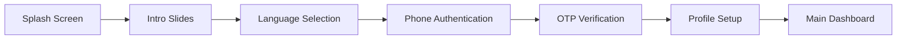

# 🌾 KrishiMitra - Smart Farming Companion

[](https://krishimitr.netlify.app/)
[](https://reactnative.dev/)
[](https://expo.dev/)
[](https://www.typescriptlang.org/)
[](https://supabase.com/)

> 🚀 **Live Application:** [https://krishimitr.netlify.app/](https://krishimitr.netlify.app/)

A comprehensive mobile application designed as an intelligent farming companion for modern farmers. KrishiMitra integrates IoT monitoring, AI-powered crop diagnostics, community features, financial services, and multilingual support to revolutionize agricultural practices.

## 📱 Demo & Screenshots

🔗 **[Try the Live Demo](https://krishimitr.netlify.app/)**

*Experience KrishiMitra directly in your  mobile device*

## ✨ Features

### 🔬 **Smart Monitoring**
- Real-time IoT sensor data visualization
- Temperature, humidity, and soil condition monitoring
- ThingSpeak integration for seamless data collection
- QR code device pairing for instant setup

### 🤖 **AI-Powered Crop Diagnostics**
- Advanced image recognition for disease detection
- Gemini AI integration for accurate analysis
- Instant treatment recommendations
- Photo-based crop health assessment

### 👥 **Community Platform**
- Farmer-to-farmer knowledge sharing
- Post sharing and status updates
- Local farming community connection
- Experience-based learning network

### 💰 **Financial Services**
- Intelligent loan calculators
- Bank and financial institution locator
- Agricultural finance guidance
- Credit assessment tools

### 🌍 **Multilingual Support**
- English and Hindi language support
- Localized user interface
- Cultural adaptation for Indian farmers
- Easy language switching

## 🚀 Live Deployment

The application is deployed and accessible at:

**🔗 [https://krishimitr.netlify.app/](https://krishimitr.netlify.app/)**

- **Platform:** Netlify
- **Status:** ✅ Active
- **Responsive:** Mobile & Desktop optimized
- **PWA Ready:** Progressive Web App capabilities

## 🛠️ Tech Stack

| Technology | Purpose | Badge |
|------------|---------|-------|
| **React Native** | Cross-platform mobile development |  |
| **Expo** | Development platform and toolkit |  |
| **TypeScript** | Type-safe JavaScript development |  |
| **Supabase** | Backend-as-a-Service & Database |  |
| **ThingSpeak** | IoT data platform integration |  |
| **Gemini AI** | Advanced AI analysis engine |  |
| **Netlify** | Web deployment platform |  |

## 📁 Project Structure

```
krishi-mitra/
├── 📁 app/                          # Main application code
│   ├── 📁 (onboarding)/            # Onboarding flow screens
│   │   ├── 🔒 auth.tsx             # Phone OTP authentication
│   │   ├── 🎯 intro.tsx            # Feature introduction slides
│   │   ├── 🌐 language-selection.tsx # Language preference setup
│   │   ├── 👤 profile-setup.tsx    # User profile creation
│   │   └── ✨ splash.tsx           # Animated splash screen
│   ├── 📁 (tabs)/                  # Main navigation tabs
│   │   ├── 🏠 home/                # IoT monitoring dashboard
│   │   ├── 👥 community/           # Social features
│   │   ├── 🤖 ai/                  # AI crop diagnostics
│   │   ├── 💰 finance/             # Financial services
│   │   └── 👤 profile/             # User profile management
│   ├── 🎯 _layout.tsx              # Root app layout
│   └── 🚀 index.tsx                # Application entry point
├── 📁 components/                   # Reusable UI components
│   ├── 📱 QRScanner.tsx            # IoT device QR scanner
│   └── ✨ SplashScreen.tsx         # Animated splash component
├── 📁 constants/                    # App constants and configs
│   ├── 🎨 Colors.ts                # Color palette
│   └── 🌐 Languages.ts             # Supported languages & translations
├── 📁 contexts/                     # React context providers
│   ├── 🔐 AuthContext.tsx          # Authentication state management
│   └── 🌐 LanguageContext.tsx      # Language and translation context
├── 📁 lib/                         # Core services and utilities
│   ├── 🤖 aiService.ts             # AI analysis integration
│   ├── 📱 qrScanner.ts             # QR code processing logic
│   ├── 🗄️ storage.ts              # Local storage wrapper
│   ├── 🔗 supabase.ts              # Supabase client and services
│   ├── 📊 thingspeak.ts            # IoT data integration
│   ├── 🌐 translations.ts          # Multi-language support
│   └── ⛅ weather.ts               # Weather API integration
├── 📁 supabase/                     # Backend configuration
│   ├── 📁 functions/               # Edge functions
│   │   └── 🤖 ai-analysis/         # Gemini AI integration
│   └── 📁 migrations/              # Database schema migrations
└── 📄 Configuration Files
    ├── app.json                    # Expo app configuration
    ├── package.json               # Dependencies and scripts
    ├── tsconfig.json             # TypeScript configuration
    └── eas.json                  # EAS build configuration
```

## ⚡ Quick Start

### Prerequisites

Before running KrishiMitra, ensure you have:

- ✅ **Node.js** (v16 or higher)
- ✅ **npm** or **yarn** package manager
- ✅ **Expo CLI** (`npm install -g @expo/cli`)
- ✅ **Android/iOS emulator** or physical device
- ✅ **Supabase account** for backend services
- ✅ **Gemini API key** for AI features
- ✅ **ThingSpeak account** for IoT integration

### 🔧 Installation

1. **Clone the repository**
   ```bash
   git clone https://github.com/techiepookie/krishi-mitra.git
   cd krishi-mitra
   ```

2. **Install dependencies**
   ```bash
   npm install
   # or
   yarn install
   ```

3. **Configure environment variables**
   
   Create a `.env` file in the root directory:
   ```env
   EXPO_PUBLIC_SUPABASE_URL=your_supabase_url
   EXPO_PUBLIC_SUPABASE_ANON_KEY=your_supabase_anon_key
   EXPO_PUBLIC_GEMINI_API_KEY=your_gemini_api_key
   EXPO_PUBLIC_THINGSPEAK_API_KEY=your_thingspeak_api_key
   EXPO_PUBLIC_WEATHER_API_KEY=your_weather_api_key
   ```

4. **Set up Supabase backend**
   ```bash
   # Install Supabase CLI
   npm install -g supabase
   
   # Initialize and link your project
   supabase init
   supabase link --project-ref your_project_reference
   
   # Apply database migrations
   supabase db push
   
   # Deploy edge functions
   supabase functions deploy ai-analysis
   ```

5. **Start the development server**
   ```bash
   npx expo start
   ```

6. **Run on your preferred platform**
   - 📱 **Android:** Press `a` or scan QR with Expo Go
   - 🍎 **iOS:** Press `i` or scan QR with Expo Go
   - 🌐 **Web:** Press `w` to open in browser

## 📦 Deployment

### Production Build

```bash
# Build with EAS (recommended)
npx eas build --platform all

# Or build locally
npx expo export
```

### Web Deployment (Current)

The application is currently deployed on Netlify:

- **URL:** [https://krishimitr.netlify.app/](https://krishimitr.netlify.app/)
- **Build Command:** `expo export:web`
- **Publish Directory:** `dist`

## 🔄 User Journey

### 1. 🎯 **Onboarding Experience**


### 2. 📱 **Core Application Flow**
- **Home Tab:** Real-time IoT monitoring and weather data
- **Community Tab:** Social networking and knowledge sharing
- **AI Tab:** Crop disease diagnosis and treatment recommendations
- **Finance Tab:** Agricultural loans and financial planning
- **Profile Tab:** User settings and account management

## 🔐 Authentication & Security

- 📞 **Phone-based authentication** with OTP verification
- 🔒 **Supabase Auth** integration for secure user management
- 🛡️ **Row Level Security (RLS)** for database protection
- 🔑 **JWT tokens** for session management
- 📱 **Secure local storage** for offline capabilities

## 🌐 API Integrations

| Service | Purpose | Implementation |
|---------|---------|----------------|
| **Supabase** | User authentication, database, real-time updates | `lib/supabase.ts` |
| **ThingSpeak** | IoT sensor data collection and visualization | `lib/thingspeak.ts` |
| **Gemini AI** | Crop disease detection and analysis | `supabase/functions/ai-analysis/` |
| **Weather API** | Local weather conditions and forecasts | `lib/weather.ts` |
| **Expo Location** | GPS coordinates for location-based features | Profile setup |

## 🗄️ Database Schema

```sql
-- Users Profile Table
CREATE TABLE profiles (
    id UUID REFERENCES auth.users(id) PRIMARY KEY,
    phone VARCHAR UNIQUE NOT NULL,
    full_name VARCHAR NOT NULL,
    avatar_url VARCHAR,
    location VARCHAR,
    land_type VARCHAR,
    agriculture_type VARCHAR,
    crops TEXT[],
    created_at TIMESTAMPTZ DEFAULT NOW(),
    updated_at TIMESTAMPTZ DEFAULT NOW()
);

-- Row Level Security Policies
ALTER TABLE profiles ENABLE ROW LEVEL SECURITY;
```

## 🤝 Contributing

We welcome contributions from the community! Here's how you can help:

1. **🍴 Fork the repository**
2. **🌿 Create a feature branch** (`git checkout -b feature/AmazingFeature`)
3. **💾 Commit your changes** (`git commit -m 'Add some AmazingFeature'`)
4. **📤 Push to the branch** (`git push origin feature/AmazingFeature`)
5. **🔀 Open a Pull Request**

### Development Guidelines

- ✅ Follow TypeScript best practices
- ✅ Write clean, documented code
- ✅ Test your changes thoroughly
- ✅ Maintain consistent code formatting with Prettier
- ✅ Follow the existing project structure

## 🚧 Roadmap

### 🔜 Upcoming Features

- [ ] 🌾 **Crop Yield Prediction** using machine learning
- [ ] 🛰️ **Satellite Imagery** integration for field monitoring
- [ ] 💬 **Real-time Chat** for community interactions
- [ ] 📊 **Advanced Analytics** dashboard
- [ ] 🔔 **Push Notifications** for alerts and reminders
- [ ] 🌐 **Additional Languages** (Punjabi, Marathi, Tamil)
- [ ] 🤝 **Marketplace Integration** for crop selling
- [ ] 🎓 **Educational Content** and farming tutorials

### 🛠️ Technical Improvements

- [ ] 🔄 **Offline-first architecture**
- [ ] ⚡ **Performance optimization**
- [ ] 🧪 **Comprehensive testing suite**
- [ ] 🔐 **Enhanced security measures**
- [ ] 📱 **Native mobile apps** (App Store & Play Store)

## 📊 Performance & Analytics

- ⚡ **Load Time:** < 3 seconds initial load
- 📱 **Responsive Design:** Mobile-first approach
- 🔄 **Real-time Updates:** WebSocket connections for live data
- 💾 **Offline Support:** Progressive Web App capabilities
- 🌐 **Cross-platform:** Works on Android, iOS, and Web

## 🐛 Known Issues & Troubleshooting

### Common Issues

1. **QR Scanner not working**
   - Ensure camera permissions are granted
   - Check if running on HTTPS (required for camera access)

2. **Location services failing**
   - Verify location permissions
   - Enable GPS on device

3. **AI analysis timeout**
   - Check Gemini API key configuration
   - Verify internet connection

## 📄 License

This project is licensed under the **MIT License** - see the [LICENSE](LICENSE) file for details.

## 🙏 Acknowledgments

- 🌾 **Indian farming community** for inspiration and feedback
- 🤖 **Google Gemini AI** for advanced crop analysis capabilities
- 🔧 **Expo Team** for excellent development tools
- 🗄️ **Supabase** for robust backend infrastructure
- 👥 **Open source community** for amazing libraries and tools

---

## 📞 Support & Contact

- 🌐 **Live Demo:** [https://krishimitr.netlify.app/](https://krishimitr.netlify.app/)
- 📧 **Email:** nikhilkunar1241@outlook.com
- 🐛 **Issues:** [GitHub Issues](https://github.com/techiepookie/krishi-mitra/issues)
- 💬 **Discussions:** [GitHub Discussions](https://github.com/techiepookie/krishi-mitra/discussions)

---

<div align="center">

**🌟 If you find this project helpful, please give it a star! 🌟**

[](https://github.com/techiepookie/krishi-mitra/stargazers)
[](https://github.com/techiepookie/krishi-mitra/network/members)

**Made with ❤️ for the farming community in India**

[🔗 **Visit Live Application**](https://krishimitr.netlify.app/)

</div>
